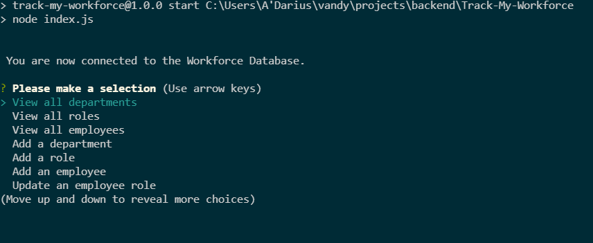

# Track-My-Workforce

## User Story

- AS A business owner
  I WANT to be able to view and manage the departments, roles, and employees in my company
  SO THAT I can organize and plan my business

### GIVEN a command-line application that accepts user input

- WHEN I start the application
  THEN I am presented with the following options: view all departments, view all roles, view all employees, add a department, add a role, add an employee, and update an employee role
- WHEN I choose to view all departments
  THEN I am presented with a formatted table showing department names and department ids
- WHEN I choose to view all roles
  THEN I am presented with the job title, role id, the department that role belongs to, and the salary for that role
- WHEN I choose to view all employees
  THEN I am presented with a formatted table showing employee data, including employee ids, first names, last names, job titles, departments, salaries, and managers that the employees report to
- WHEN I choose to add a department
  THEN I am prompted to enter the name of the department and that department is added to the database
- WHEN I choose to add a role
  THEN I am prompted to enter the name, salary, and department for the role and that role is added to the database
- WHEN I choose to add an employee
  THEN I am prompted to enter the employee’s first name, last name, role, and manager and that employee is added to the database
- WHEN I choose to update an employee role
  THEN I am prompted to select an employee to update and their new role and this information is updated in the database

# Purpose

A command line application that to track and manage departments, roles, and employees so the employer can organize and plan the business.

## Built with

- Javascript
- Node
- SQL2 package
- Express package
- Inquirer package
- Console.table Package

## Challenges

- The hardest challenge was creating the role function. Trying to get everything to be in sync when you are adding a role was difficult to do, but I learned a lot by solving the problem.

## Website

- https://github.com/gadaell/Track-My-Workforce

## Demonstration Video

- https://watch.screencastify.com/v/VOyJisTvh7n0t8J7e5h4

## Contact

- If you have any questions with the application, please contact me at ellisadarius@gmail.com

## Contribution/Credits

Made by A'Darius (A'D) Ellis

## License

None

### ©️2021 Track-My-Workforce
